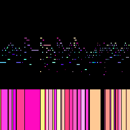

# MidiPic: Midi to Image translation for ML datasets

This software converts Midi to image snippets and back, and creates datasets to train image generation models on music.

To train a model you can use [JoliGEN](https://github.com/jolibrain/joligen). Tutorial coming soon!

## Install
```bash
pip install -r requirements.txt
```

## Usage
```bash
# Create an image dataset from example.mid
python create_dataset.py example.mid --output_dir images --overlap_count 2 -v
```

It creates an image like this:

